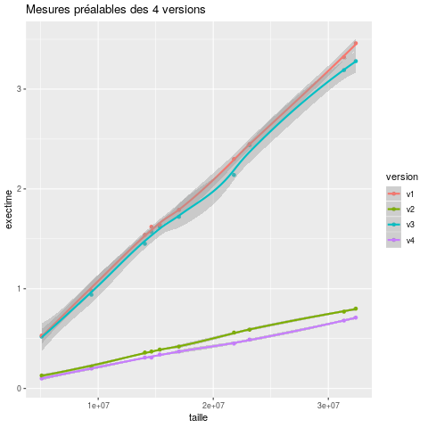
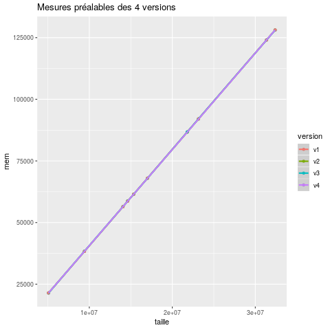

# P4a : Analyse de performances de différentes structures

[Grille d'évaluation P4a](Evaluation.md)

## Language

Pour cette session de comparaison, nous utilisons le Java.

## Problème

### Description du Problème

Pendant tout notre DUT nous avons utilisé en java principalement les ArrayList<> pour stocker des informations dans un tableau mais est-ce toujours le bon choix. C’est pourquoi nous allons analyser les performances des structures suivantes : [ArrayList<>](https://docs.oracle.com/javase/7/docs/api/java/util/ArrayList.html), [HashMap<>](https://docs.oracle.com/javase/7/docs/api/java/util/HashMap.html), [Stack<>](https://docs.oracle.com/javase/7/docs/api/java/util/Stack.html) et [LinkedList<>](https://docs.oracle.com/javase/7/docs/api/java/util/LinkedList.html). Pour savoir quand et pourquoi utiliser une structure ou une autre.

### Paramètres exploratoires du problème

Dans le cadre des tests de comparaison de performance entre une ArrayList et une LinkedList en Java, nous avons mis en place les tests de rapidité et de performance suivants.

- Ajout d'éléments dans chaque liste,
- suppression d'éléments dans chaque list,
- récupération d'éléments dans chaque list.

Ainsi, nous pouvons comparer les résultats sur chaque opération et en déduire laquelle est la plus optimale en fonction de l'utilisation souhaitée avec un bon rapport rapidité/performance CPU utilisé.

## Dispositif expérimental

### Organisation objet

Description de l'organisation des classes et interfaces, ou diagramme de classes.


### Application

[code source de l'application](chemin)
```
Description de l'application et des arguments
```

### Environnement de test

Description de la plateforme de test
```
Extrait pertinent de /proc/cpuinfo
```

### Description de la démarche systématique

Description de la démarche systématique et de l'espace d'exploration pour chaque paramètres.

```
Suite des commandes, ou script, à exécuter pour produire les données.
```

## Résultats préalables

### Temps d'exécution



### Consommation mémoire



### Analyse des résultats préalables

La mémoire se comporte exactement pareil sur les 4 versions.
Les temps d'exécutions dépendent essentiellement de l'affichage des valeurs du tableau.
La version 2 de recherche semble un peu plus rapide.

### Discussion des résultats préalables

Explications précises et succinctes sur ce que les limites des résultats
préalables et ce qu'ils ne permettent pas de vérifier.

## Etude approfondie

### Hypothèse

Expression précise et succincte d'une hypothèse.

### Protocole expérimental de vérification de l'hypothèse

Expression précise et succincte du protocole.

```
Suite des commandes, ou script, à exécuter pour produire les données.
```

### Résultats expérimentaux

### Analyse des résultats expérimentaux

### Discussion des résultats expérimentaux

## Conclusion et travaux futurs
