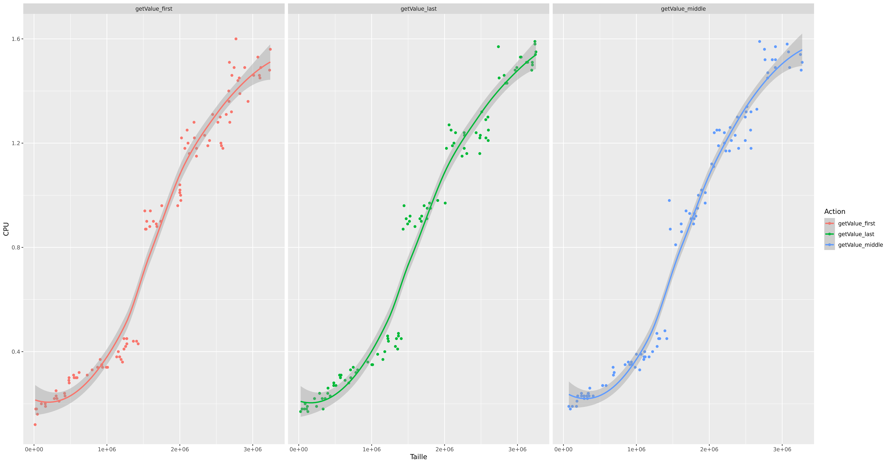
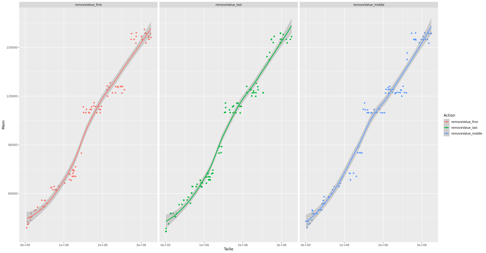
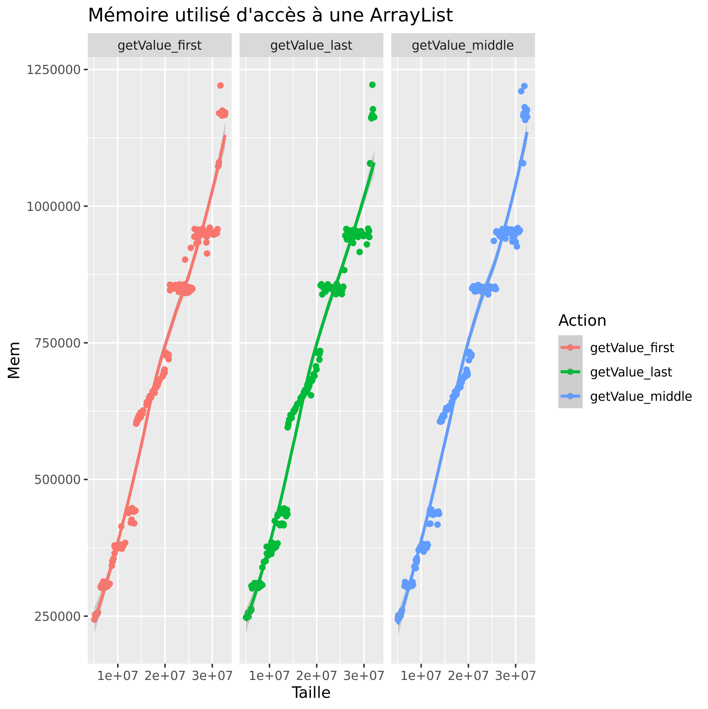

# P4a : Analyse de performances de différentes structures

[Grille d'évaluation P4a](Evaluation.md)

## Language

Pour cette session de comparaison, nous avons utilisé le language de programmation orientée objet Java.

## Problème

### Description du Problème

Pendant tout notre DUT nous avons régulièrement utilisé, en java, les ArrayList<> pour stocker des informations dans un tableau mais était-ce toujours le bon choix. C’est pourquoi nous allons analyser les performances des structures suivantes dans l'optique de savoir quand et pourquoi utiliser une structure ou une autre : [ArrayList<>](https://docs.oracle.com/javase/7/docs/api/java/util/ArrayList.html), [Vector<>](https://docs.oracle.com/javase/7/docs/api/java/util/Vector.html) et [LinkedList<>](https://docs.oracle.com/javase/7/docs/api/java/util/LinkedList.html)

### Paramètres exploratoires du problème

Dans le cadre des tests de comparaison de performance entre une ArrayList, Vector et LinkedList en Java, nous avons mis en place les tests de rapidité et de performance suivants.

- Remplissage d'éléments dans chaque liste,
- Ajout d'éléments dans chaque liste au début au milieu et à la fin,
- suppression d'éléments dans chaque list au début au milieu et à la fin,
- récupération d'éléments dans chaque list au début au milieu et à la fin,
- modification d'éléments dans chaque list au début au milieu et à la fin.


Ainsi, nous pouvons comparer les résultats sur chaque opération et en déduire laquelle est la plus optimale en fonction de l'utilisation souhaitée avec un bon rapport rapidité/performance CPU/Mémoire utilisée.

## Dispositif expérimental

### Organisation objet

Description de l'organisation des classes et interfaces, ou diagramme de classes.


### Application

[code source de l'application](https://git.unistra.fr/iledig/P4a/-/tree/master/program)


### Environnement de test

Description de la plateforme de test
```
Extrait pertinent de /proc/cpuinfo

processor       : 2
vendor_id       : AuthenticAMD
cpu family      : 6
model           : 2
model name      : QEMU Virtual CPU version 0.13
microcode       : 0x1000065
cpu MHz         : 2294.246
cache size      : 512 KB
flags           : fpu de pse tsc msr pae mce cx8 apic sep mtrr pge mca cmov pat pse36 clflush mmx fxsr sse sse2 syscall nx lm nopl cpuid tsc_known_freq pni cx16 popcnt hypervisor lahf_lm svm abm sse4a 3dnowprefetch vmmcall
bogomips        : 4588.49
TLB size        : 1024 4K pages
clflush size    : 64
cache_alignment : 64
address sizes   : 40 bits physical, 48 bits virtual

```

### Description de la démarche systématique

```
Ligne de commande à executer: ./run.sh
Les paramètres sont le types de structures à tester (ArrayList, LinkedList ou Vector) suivie de l'action a effectuer puis la taille de la structure. 

On observe la consommation CPU, consommation espace mémoire des structures selon les differentes actions et selon la taille de la structure  
```

La démarche systématique consiste à lancer le fichier run.sh qui va executer le code. Une fois le code exécuter. Cela générera un fichier Perf.csv qui sera lisible avec le logiciel R qui pourra, grâce au fichier Rscript.R, générer 4 graphiques : 

- -Graph_Time.png qui affiche la consommation CPU des Structures ArrayList, LinkedList et Vector

- -Graph_Mémoire.png qui affiche la consommation Memoir des Structures ArrayList, LinkedList et Vector

- Graph_Time_VA.png qui affiche la consommation CPU des Structures ArrayList, LinkedList et Vector. Il est utilisé pour comparer les structures ArrayList et Vector

- Graph_Time_VA2.png qui affiche la consommation CPU des Structures ArrayList, LinkedList et Vector


## Résultats préalables

### Temps d'exécution
VA = graphique pour comparaison Vecteur ArrayList
|   Graph   |
|---	    |
||
||
**Moyenne consommation CPU**
||

|   Légende   |   ArrayList	|   Vector	|   LinkedList	|
|---	      |---	        |   ---	    |   ---	        |
|      Ajout          |     |   |   
|      Modification   |   |  |   
|      Suppression    |   |  |    

### Consommation mémoire

|   Graph   |
|---	    |
||
||
**Moyenne consommation espace mémoire**
||

|   Légende   |   ArrayList	|   Vector	|   LinkedList	|
|---	      |---	        |   ---	    |   ---	        |
|  Ajout  |  ||  |
|  Modification|| |	|
|  Suppression | ||	|


### Analyse des résultats préalables

**Consommation Mémoire**

On observe que, lorsque la taille de la structure grandie, la structure Vector est celle qui consomme le moins d'espace de mémoire suivis de près par la structure ArrayList. Pour ce qui est de la structure LinkedList, c'est celle qui consomme le plus d'espace de mémoire. On constate que pour l'ensemble des structures, il y a des paliers qui apparraissent selon leur taille. C'est-à-dire que lorsque la taille dépasse ou descend en dessous d'une certaine quantité, la consommation vas fortement augmenter ou diminuer.

**Consommation CPU**

On observe que la structure LinkedList se distingue fortement des autres structures avec la partie consommation du CPU qui augmente de manière exponentiel lorsque la taille de la structure devient grande. On constate, pour la structure LinkedList, qu'à partir d'un certain niveau le saut entre deux paliers augmente d'environ 8sec. Pour les structures Vector et ArrayList, on remarque pas de grandes différences mais on constate encore une fois que la structure Vector est plus performante lorsque la taille du tableau est grande.

**Consommation CPU et Mémoire**

On peut en déduire qu'en général la structure la plus performante sur des listes de grandes tailles est la structure Vector suivie de près par la structure ArrayList et suivie de loin par LinkedList à cause de sa trop grande consommation du CPU.
Vector > ArrayList > LinkedList

### Discussion des résultats préalables

Explications précises et succinctes sur les limites des résultats
préalables et ce qu'ils ne permettent pas de vérifier.

Sur nos résultats préalables, on remarque que les structures ArrayList et Vector sont très similaires.
Pour notre utilisation au DUT, on pourrait remplacer une ArrayList par un Vector. On n'y verrait pas la différence.
La structure LinkedList, héritant aussi de List<>, est moins performante car cette strucuture utilise beaucoup de petits objets de mémoire ce qui signifie que toute opération indexées nécessitent une opération transversale.

## Etude approfondie

### Hypothèse

Tout au long de notre analyse des résultats préalables nous avons constaté que les ArrayList et les Vectors possèdes des performances équivalentes. Il serait judicieux de savoir finalement qu'elle est la structure la plus intéressante sur des structures de plus de cinq-millions de valeurs.

Pour le savoir nous allons utiliser les structures ArrayList et Vector qui seront composer de cinq-millions d'objets. Nous y testerons différentes actions.

### Protocole expérimental de vérification de l'hypothèse

```
Ligne de commande à executer: ./runH.sh
Les paramètres sont le types de structures ArrayList et Vector suivie de l'action à effectuer puis la taille de la structure qui ne peut être inferieur à 5 000 000. 
Car nous voulons étudier la consommation du CPU, consommation mémoire pour les differentes actions sur les deux structure lorsque elle doivent travaillé avec des grandes taille.

```
La démarche systématique consiste à lancer le fichier runH.sh qui va exécuter le code. Cela générera un fichier PerfH.csv qui pourra être lancé avec le logiciel R qui qui générera grâce au fichier RHscript.R, les différents graphiques pour comparer les structure Vector et ArrayList.

### Résultats expérimentaux
### Temps d'exécution

|   Légende   |   ArrayList	|   Vector	| 
|---	      |---	        |   ---	    |
|      Ajout         |   	    |   	|
|      Modification         |   	|  |
|      Suppression          |   	|   |

### Consommation mémoire
|   Légende   |   ArrayList	|   Vector	| 
|---	      |---	        |   ---	    |
|      Ajout         |   	    |   	|
|      Modification         |   	|  |
|      Suppression          |   	|   |

### Analyse des résultats expérimentaux
**Consommation Mémoire**

On observe que le Vector utilise moins de mémoire que l'ArrayList dans tous les cas récupération de données, de modification et de suppression des valeurs.

**Consommation CPU**

On observe que le Vectore utilise moins le CPU que l'ArrayList dans tous les cas récupération de données, de modification et de suppression des valeurs.

### Discussion des résultats expérimentaux

Grâce au nouveau graphique nous avons pu constater que les opérations que nous effectuons sur les deux structures sont plus rapides sur la structure Vector et consomment moins d'espaces mémoires que la structure ArrayList.
## Conclusion et travaux futurs

Nous pouvons en conclure que pour notre utilisation, nous devrons plus utiliser les Vector car ils sont plus performants et consomme moins d'espace mémoire quand nous manipulons beaucoup de donnée. Pour les travaux futurs, on pourrait essayer de savoir à partir de quelle taille de structure Vector serait-elle à privilégier, car dans ce projet nous nous sommes concenter sur la manipulation grande structure.
