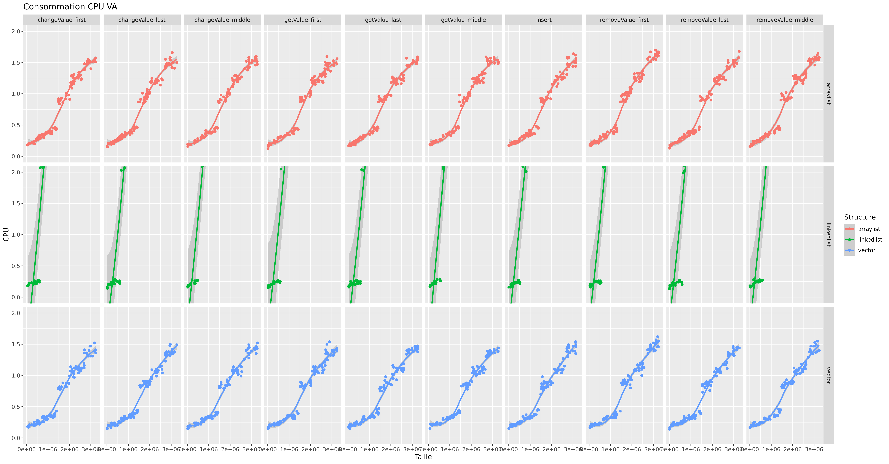
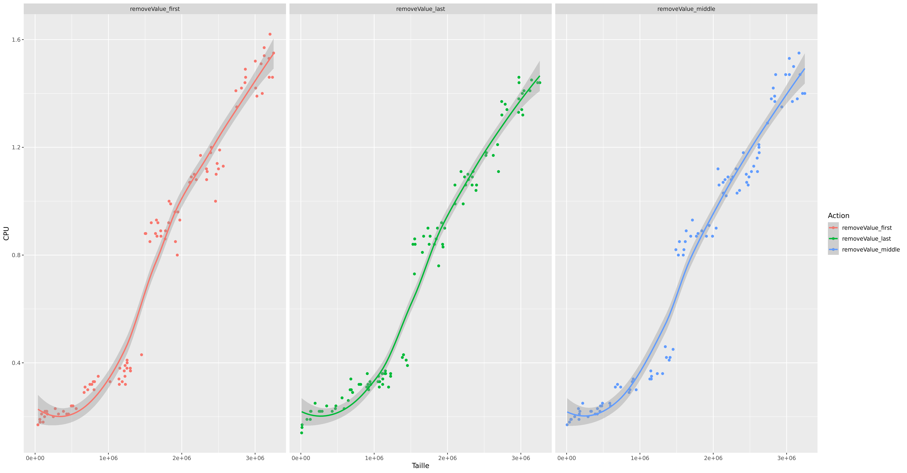
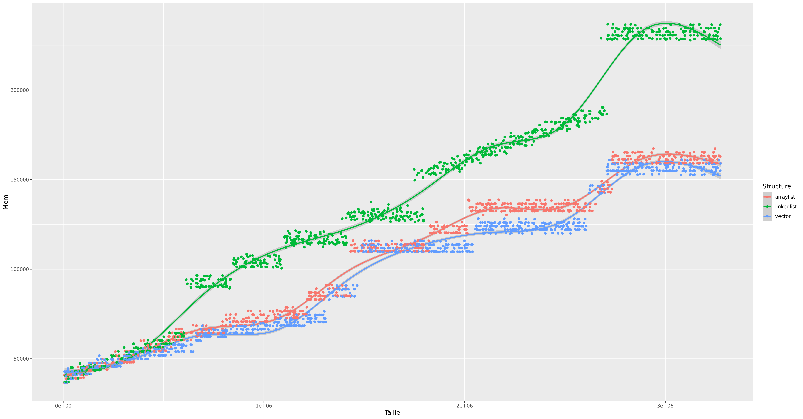
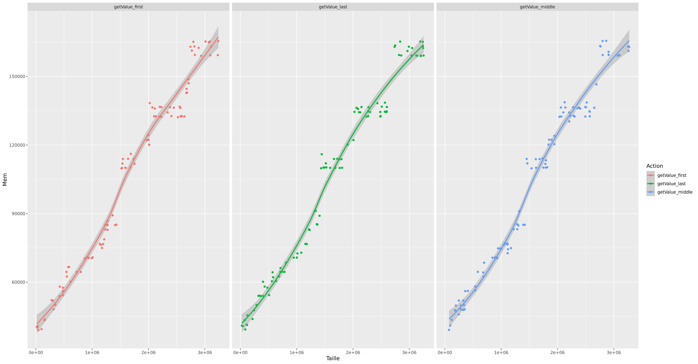
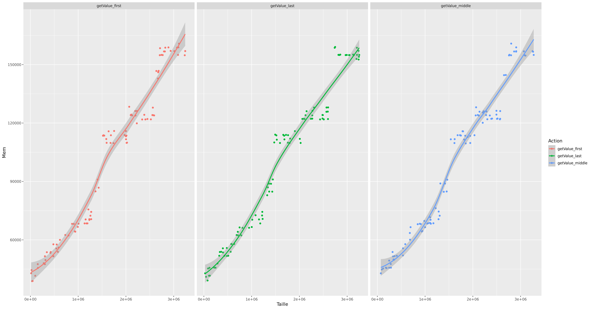
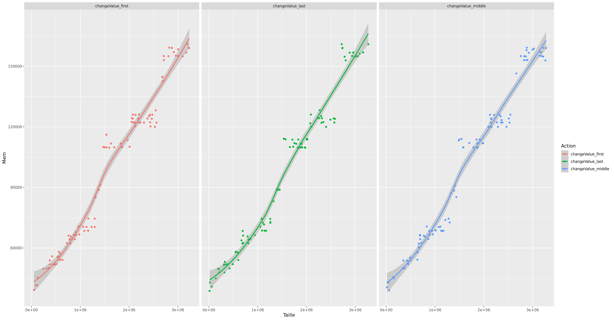
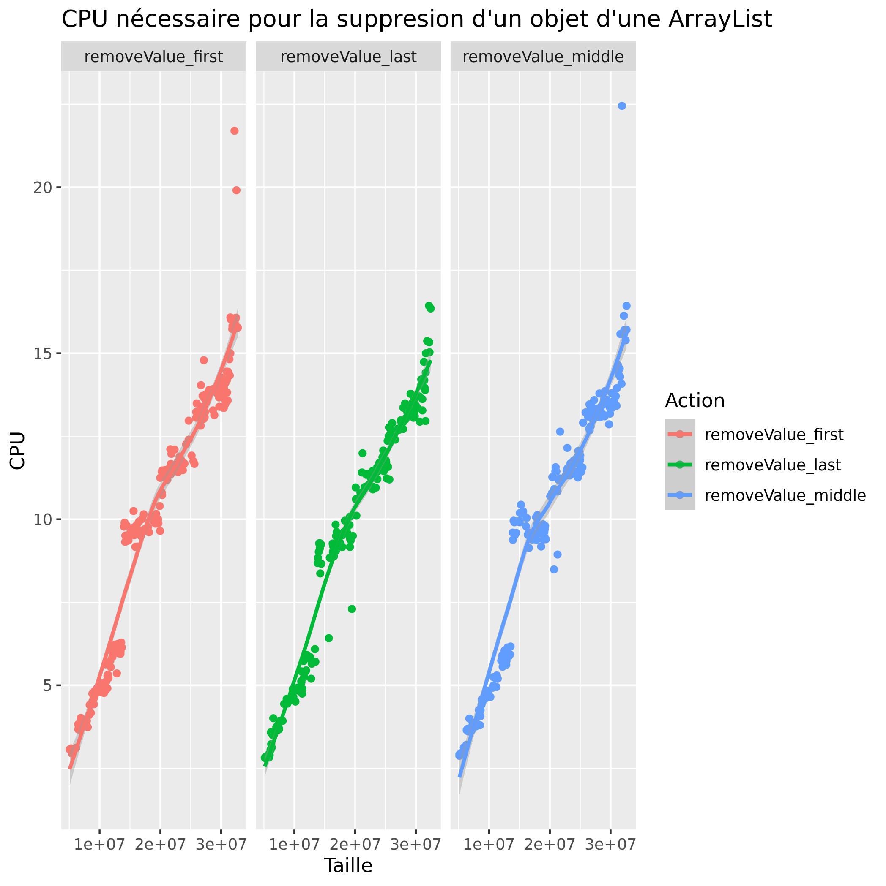
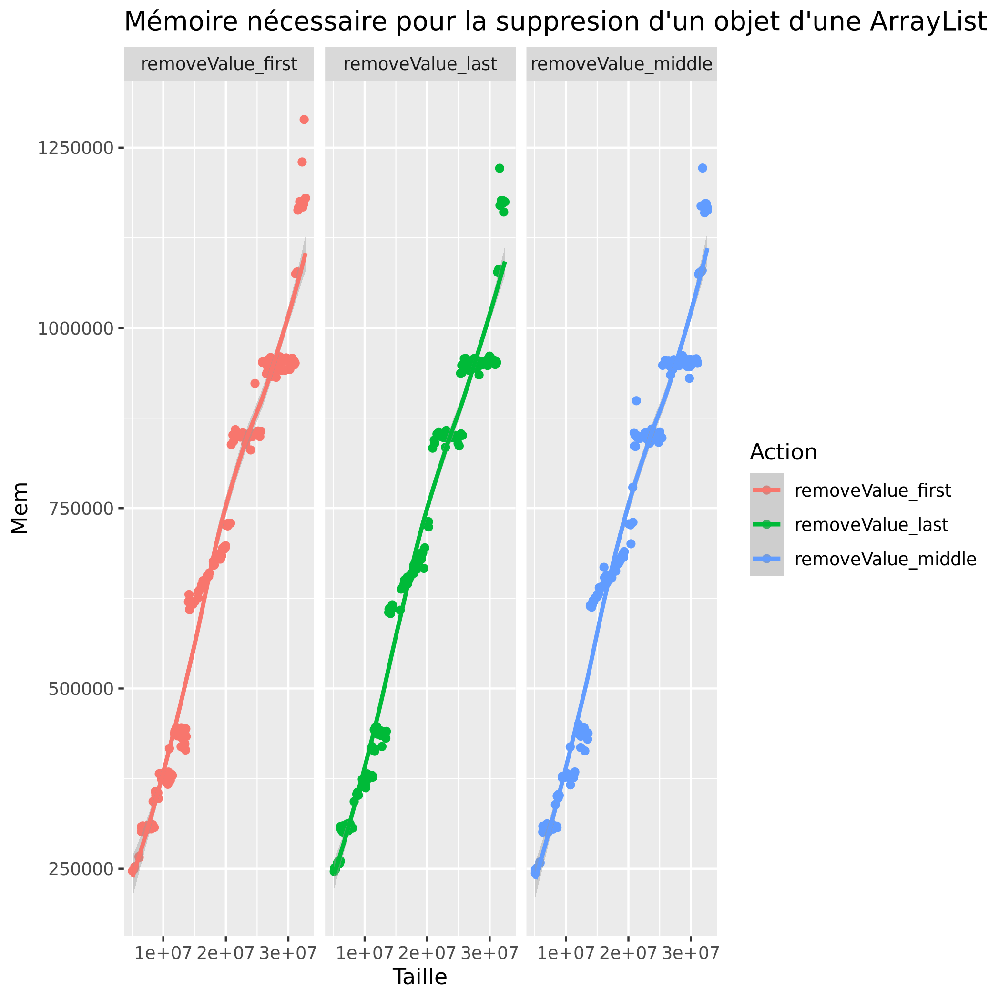

# P4a : Analyse de performances de différentes structures

[Grille d'évaluation P4a](Evaluation.md)

## Language

Pour cette session de comparaison, nous utilisons le language de programmation orientée objet Java.

## Problème

### Description du Problème

Pendant tout notre DUT nous avons utilisé en java principalement les ArrayList<> pour stocker des informations dans un tableau mais est-ce toujours le bon choix. C’est pourquoi nous allons analyser les performances des structures suivantes : [ArrayList<>](https://docs.oracle.com/javase/7/docs/api/java/util/ArrayList.html), [Vector<>](https://docs.oracle.com/javase/7/docs/api/java/util/Vector.html) et [LinkedList<>](https://docs.oracle.com/javase/7/docs/api/java/util/LinkedList.html). Pour savoir quand et pourquoi utiliser une structure ou une autre.

### Paramètres exploratoires du problème

Dans le cadre des tests de comparaison de performance entre une ArrayList, Vector et LinkedList en Java, nous avons mis en place les tests de rapidité et de performance suivants.

- Remplissage d'éléments dans chaque liste,
- Ajout d'éléments dans chaque liste au début au milieu et à la fin,
- suppression d'éléments dans chaque list au début au milieu et à la fin,
- récupération d'éléments dans chaque list au début au milieu et à la fin,
- modification d'éléments dans chaque list au début au milieu et à la fin,


Ainsi, nous pouvons comparer les résultats sur chaque opération et en déduire laquelle est la plus optimale en fonction de l'utilisation souhaitée avec un bon rapport rapidité/performance CPU utilisé.

## Dispositif expérimental

### Organisation objet

Description de l'organisation des classes et interfaces, ou diagramme de classes.


### Application

[code source de l'application](https://git.unistra.fr/iledig/P4a/-/tree/master/program)


### Environnement de test

Description de la plateforme de test
```
Extrait pertinent de /proc/cpuinfo

processor       : 2
vendor_id       : AuthenticAMD
cpu family      : 6
model           : 2
model name      : QEMU Virtual CPU version 0.13
microcode       : 0x1000065
cpu MHz         : 2294.246
cache size      : 512 KB
flags           : fpu de pse tsc msr pae mce cx8 apic sep mtrr pge mca cmov pat pse36 clflush mmx fxsr sse sse2 syscall nx lm nopl cpuid tsc_known_freq pni cx16 popcnt hypervisor lahf_lm svm abm sse4a 3dnowprefetch vmmcall
bogomips        : 4588.49
TLB size        : 1024 4K pages
clflush size    : 64
cache_alignment : 64
address sizes   : 40 bits physical, 48 bits virtual

```

### Description de la démarche systématique

```
Ligne de commande à executer: ./run.sh
Les parramètres sont le types de structures ArrayList,LindeList et vector suivie de l'action a effectuer puis la taille de la structure. 
```

La démarche systématique consiste à lancer le fichier run.sh qui vas executer le code. Une fois le code executer. Cela aura générer un fichier Perf.csv et le lancer avec le logiciel R qui lui grace au fichier Rscript.R vas generer 4 graphique: 

- -Graph_Time.png qui afiche la consommation CPU des Structures ArrayList, LinkedList et Vector

- -Graph_Mémoire.png  qui afiche la consommation Memoir des Structures ArrayList, LinkedList et Vector

- Graph_Time_VA.png  qui afiche la consommation CPU des Structures ArrayList, LinkedList et Vector, mais qui est générer pour comparer les structure ArrayList et Vector

- Graph_Time_VA2.png  qui afiche la consommation CPU des Structures ArrayList, LinkedList et Vector


## Résultats préalables

### Temps d'exécution
VA = graphique pour comparaison Vecteur ArrayList
|   Graph   |
|---	    |
||
||
**Moyenne consommation CPU**
||

|   Légende   |   ArrayList	|   Vector	|   LinkedList	|
|---	      |---	        |   ---	    |   ---	        |
|      Ajout          |     |   |   
|      Modification   |   |  |   
|      Suppression    |   |  |    

### Consommation mémoire

|   Graph   |
|---	    |
||
||
**Moyenne consommation espace mémoire**
||

|   Légende   |   ArrayList	|   Vector	|   LinkedList	|
|---	      |---	        |   ---	    |   ---	        |
|  Ajout  |  ||  |
|  Modification|| |	|
|  Suppression | ||	|


### Analyse des résultats préalables

**Consommation Mémoire**

On observe que plus la taille de la structure est grande plus la strucure Vector est la structure qui consomme le moin d'espace de mémoire suivis de près par la strucutre ArrayList. Pour ce qui est de la strucure LindeList c'est la structure qui consomme le plus d'espace de mémoire plus la taille est grande. On constate que pour l'ensemble des structure il y a des palliers qui apparraisse selon la taille de la structure. C'est à dire que lorsque la taille dépasse une certain quantité ou descent en dessous d'une certaine quantité la consomation vas fortement augementer ou diminuer.

**Consommation CPU**

On observe que la structure LinkedList se distingue fortement des autres structures avec la partie consomation du CPU qui augemente de manière exponentiel plus la taille de la structure est grande. On constate pour la structure LinkedList que a partir d'un certain niveau le saut entre deux palier est grande d'environ 8sec. Pour les structures Vector et ArrayList on remarque pas de grande differences mais on constate encore une fois que la structure Vector est plus performentes lus la taille du tableau est grande.

**Consommation CPU et Mémoire**

On peux en déduire que en général la structure la plus performantes sur des lites de grande tailles est la structure Vector suivie de près par la structure ArrayList et suivie de loin par LinkedList accause de sa trop grande consommation du CPU.
Vector > ArrayList > LinkedList

### Discussion des résultats préalables

Explications précises et succinctes sur ce que les limites des résultats
préalables et ce qu'ils ne permettent pas de vérifier.

Sur nos résultats préalables on remarque que les structures ArrayListet Vector sont très similaires.
Pour notre utilisation au dut on pourrait remplacer une ArrayList par un Vector on ne verrais pas la différence et inversement.
Pour la structure LinkedList qui hérite aussi de List<> mais est moin performant qui est surment du au fait que cette strucuture utilise beaucoup de petits objets de mémoire ce qui signifie que toute opération indexée nécessite une opération transversale.

## Etude approfondie

### Hypothèse

Tous au long de notre analyse du résultats préalables nous avons constater que les ArrayList et les Vectors possèdes des performances équivalente. Il serait judicieux de savoir finalement qu'elles est la structure la plus intéressant sur des structure de plus de cinq-millions de valeurs ?

Pour le savoir nous allons utiliser des structures ArrayList et Vector qui seront composer de cinq-millions d'objets et faire différentes actions sur ces structures.

### Protocole expérimental de vérification de l'hypothèse

```
Ligne de commande à executer: ./runH.sh
Les parramètres sont le types de structures ArrayList,LindeList et vector suivie de l'action a effectuer puis la taille de la structure. 
```
La démarche systématique consiste à lancer le fichier runH.sh qui vas executer le code. Une fois le code executer. Cela aura générer un fichier PerfH.csv et le lancer avec le logiciel R qui lui grace au fichier RHscript.R vas generer differents graphique pour pouvoir comparer les structure Vector et ArrayList.

### Résultats expérimentaux
### Temps d'exécution

|   Légende   |   ArrayList	|   Vector	| 
|---	      |---	        |   ---	    |
|      Ajout         |   	    |   	|
|      Modification         |   	|  |
|      Suppression          |   	|   |

### Consommation mémoire
|   Légende   |   ArrayList	|   Vector	| 
|---	      |---	        |   ---	    |
|      Ajout         |   	    |   	|
|      Modification         |   	|  |
|      Suppression          |   	|   |

### Analyse des résultats expérimentaux
**Consommation Mémoire**

On observe encore une fois ce qui est normal que plus la taille des tructures est grande plus il y aura une plus grande consommation de mémoire des deux structures. On constate surtout que en général lorsque les deux structures travail avec des petites taille entre [1e+07,2e+07] il consomme approximativement la même consommation mémoire puis une fois cette interval dépasser on observe que la structure ArrayList consomme plus que Vector. On vois bien ce phénomène lorsque la taille est au maximum on remarque une difference de maximum 250 000. On observer donc que plus la taille de la structure est grande plus l'ArrayList consommera plus d'espace mémoire par rapport à Vector.

**Consommation CPU**

On constate que la structure ArrayList a plus de male à traiter les grandes structures que la structure Vector. Lorsque la taille est entre          [2e+07,3e+07].On remarque une difference d'environs 3 sec.On remarque aussi que parfois pour la structure ArrayList il y a des fois quand elle travail avec des grandes structure il y a des exceptions pour la consomation CPU qui peut donc aller j'usqua 5 seconde alors que la structure Vector ne comprte pas c'est exception.  

### Discussion des résultats expérimentaux

Grâce au nouveau graphique nous avons pu constater que les opérations que nous effectuons sur les deux structures sont plus rapide sur la structure Vector et consomme moins d'espace mémoire que la structure ArrayList.
## Conclusion et travaux futurs

Nous pouvons en conclure que pour notre utilisation nous devrons plus utiliser les vector car ils sont plus performents et consomme moins d'espace mémoire quand nous manipulons beaucoup de donnée. Pour les travaux futurs on pourrais essayer de savoir à partir de quelle taille de structure Vector serais t-elle a prévilégier car dans ce projet nous nous somme concenter sur la manipulation grande structure.
